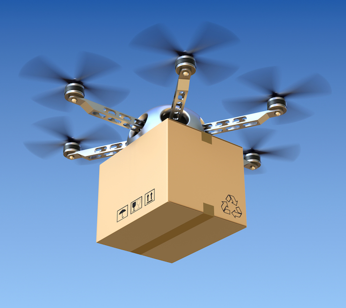
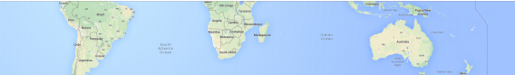
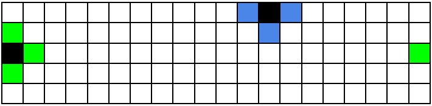
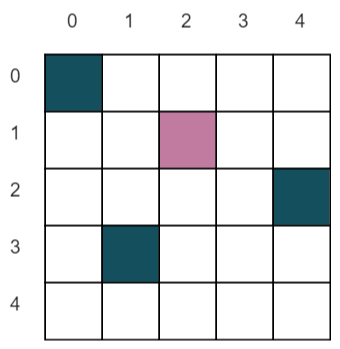
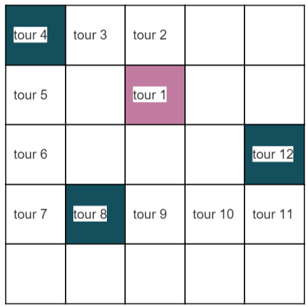

# SOAT Challenge (19 janvier 2016)

**Url :** http://soat-challenge.cloudapp.net/
**Twitter :** https://twitter.com/search?f=tweets&q=%23soatchallenge&src=typd

* [Introduction](#introduction)
* [Tâche](#tâche)
* [Description du problème](#description-du-problème)
  * [Décollage des drones et déplacement](#décollage-des-drones-et-déplacement)
  * [Livraison de colis](#livraison-de-colis)
  * [Objectif](#objectif)
* [Données d’entrée](#données-dentrée)
  * [Exemple](#exemple)
* [Soumissions](#soumissions)
  * [Format de fichier](#format-de-fichier)
    * [Exemple](#h.4egp0tgpioxa)
  * [Validation](#validation)
  * [Score](#score)

## Introduction

Un géant du web (connu pour son moteur de recherche) a décidé de concurrencer un autre géant du web (connu pour son site e-commerce) sur la livraison par drone. Ils ont donc acquit une flotte de drones permettant de livrer les colis partout dans le monde.

## Tâche

A partir des coordonnées des points de livraison, vous devez planifier les déplacements des drones pour livrer les colis à des endroits précis.

## Description du problème

### La terre

Les drones volent au dessus d’une section de la terre délimitée par deux parallèles.

*Exemple d’une section de la surface de la terre, délimitée par deux parallèles.*

Cette section est représentée par une grille rectangulaire en deux dimensions, de cotés **R** et **C​**. Les cases de cette grille sont repérées par une paire de coordonnées **\[r, c\]** dont les index démarrent à **0**, dénotant respectivement la ligne (row) et la colonne (column) de la case.
  
Comme la terre est ronde, la grille boucle aux extrémités des lignes. C'est-­à-­dire que chaque case **\[r, 0\]** est voisine des cases **\[r, C - 1\]** et **\[r, 1\]**. La grille ne boucle pas ​aux extrémités des colonnes.

*Un exemple de grille avec la case \[0, 0\] dans le coin supérieur gauche. Deux cases sont marquées en noir et les cases avec lesquelles elles sont voisines en vert et bleu.*

### Décollage des drones et déplacement

Au démarrage de la simulation, tous les drones sont dans la même case de départ, au sol et prêts à décoller.

La simulation fonctionne par tour. Au début de chaque tour :

* les drones qui sont déjà en vol peuvent ajuster leur déplacement sur la carte de 1 , 2
, 3  ou 
4 . Un drone qui a décollé ne peut plus jamais se poser durant la simulation.

* les drones qui sont encore au sol peuvent décoller (en démarrant leur déplacement par 1, 2, 3 ou 4) ou rester au sol (en appliquant un déplacement de 0).

Les déplacements seront donc à indiquer comme suit :

* Pour indiquer au drone de **rester au sol**, il faudra indiquer **0**
* Pour déplacer un drone vers la **gauche**, il faudra indiquer **1**
* Pour déplacer un drone vers le **haut**, il faudra indiquer **2**
* Pour déplacer un drone vers la **droite**, il faudra indiquer **3**
* Pour déplacer un drone vers le **bas**, il faudra indiquer **4**

Plusieurs drones peuvent se trouver dans la même case au même moment. En particulier, il est possible de faire décoller plusieurs drones par tour.

### Livraison de colis

À partir du moment où ils sont lancés et jusqu’à ce qu’ils soient perdus ou retournent à l'entrepôt, chaque drone peut se déplacer et livrer des colis aux cases survolées. Pour un drone positionné au dessus d’une case \[r, c\], **un colis peut être livré**. Lorsqu'un drone survole une case indiquée comme point de livraison, il largue automatiquement l'un de ces colis et le point de livraison devient une case ordinaire.

Un drone est limité par la charge qu'il peut transporter ainsi que par sa batterie qui limite son autonomie.

Il ne pourra donc transporter qu'un **maximum de 4 colis**. Plus un drone transporte de colis plus il aura besoin d'énergie pour les transporter. Un drone pourra donc se déplacer d'un maximum de **X - (P \* 40)** ou **X** est la distance maximale que peut effectuer le drone et **P** le nombre de colis qu'il transporte. Si le drone n'a pas livré tous ses colis avec l'autonomie dont il dispose, il sera considéré comme perdu ainsi que les colis qu'il transportait.

Son autonomie est calculé au décollage et ne sera pas réajustée en vol. Ainsi, si un drone transporte 3 colis, son autonomie ne sera pas réajustée une fois le premier colis livré.

Une fois que le drone a livré tous ces colis il retournera automatiquement à l’entrepôt et ne pourra être réutilisé que le lendemain. Un drone ne peut donc être utilisé qu'une seule fois.

### Objectif

Un ensemble de cases de la grille sont désigné comme point de livraison. À la fin de chaque tour (après que les drones aient été déplacés), chaque point de livraison survolé par un drone avec un colis contribue pour un point au score final. Un point de livraison ne peut être livré que d’un seul colis. Si un n-ième drone survole un point de livraison, aucun colis ne sera livré et aucun point ajouté au score final. L’objectif est d’obtenir le score le plus haut possible.

## Données d’entrée

Les données d’entrée sont fournies dans un fichier texte contenant exclusivement des caractères ASCII avec des lignes terminées par le
caractère ‘\\n’ (fins de ligne UNIX).

Le fichier est constitué ainsi :

* une ligne contenant les deux entiers naturels suivants, séparés par des espaces :

> **R** (1 ≤ R ≤ 1000) : le nombre de lignes de la grille
>
> **C** (1 ≤ C ≤ 1000) : le nombre de colonnes de la grille

* une ligne contenant les quatre entiers naturels suivants, séparés par des espaces :

> **L** (1 ≤ L ≤ 1500) : le nombre de cases cibles (point de livraison) et donc le nombre de colis à livrer
>
> **B** (1 ≤ B ≤ 1000) : le nombre de drones disponibles
>
> **X** (1 ≤ X ≤ 1000) : le nombre de déplacements maximum qu’un drone peut effectuer
>
> **T** (1 ≤ T ≤ 1000) : le nombre de tour de la simulation

* une ligne contenant une paire d’entiers naturels rs et cs (0 ≤ rs &lt; R, 0 ≤ cs &lt; C) séparés par un espace, donnant la case de départ des drones \[rs, cs\]

* **L** lignes décrivant les coordonnées des cases cibles (point de livraison), chaque ligne contenant :

> une paire d’entiers naturels **ri** et **ci** (0 ≤ ri &lt; R, 0 ≤ ci &lt; C) donnant les coordonnées de la **i**ème case cible **\[ri, ci\]**

### Exemple

Voici un exemple de fichier d’entrée :

| Lignes    | Descriptions                                     |
| --------- | ------------------------------------------------ |
| 5 5       | 5 lignes, 5 colonnes                             |
| 3 1 15 20 | 3 colis, 1 drone, 15 déplacements max, 20 tours  |
| 1 2       | case de départ sur la carte (ligne 1, colonne 2) |
| 0 0       | case cible sur la carte (ligne 0, colonne 0)     |
| 2 4       | case cible sur la carte (ligne 2, colonne 4)     |
| 3 1       | case cible sur la carte (ligne 3, colonne 1)     |

Visualisation de la case de départ des drones et des cases cible sur la carte :

## Soumissions

### Format de fichier

Un fichier de soumission doit être un fichier texte brut contenant seulement des caractères ASCII, avec des lignes terminées soit par le seul caractère '\\n' (style UNIX) ou les caractères '\\r\\n' (style Windows).

Le fichier doit contenir **B** lignes décrivant les déplacements appliqués aux drones à chaque tour. Ces lignes doivent toutes commencer par le nombre de colis transporté par le drone suivi d’exactement **T** entiers égaux à 0, 1, 2, 3 ou 4 et séparés par des espaces, décrivant les déplacements appliqués à chaque drone à un tour donné de la simulation.

Il est nécessaire de fournir **T** déplacements pour chaque drone, y compris si des drones ont été perdus ou retirés de la simulation. Les déplacements appliqués aux drones perdus sont sans effet (les drones ne reviendront jamais), mais ils doivent quand même se conformer aux spécifications (c’est à dire qu’ils doivent être 0, 1, 2, 3 ou ­4).

### Exemple

Le fichier de soumission suivant correspond à l'exemple de fichier d'entrée donné ci-dessus.

| Lignes                                    | Descriptions                                               |
| ----------------------------------------- | ---------------------------------------------------------- |
| 3 0 2 1 1 4 4 4 3 3 3 3 2 0 0 0 0 0 0 0 0 | Le drone 1 prend 3 colis puis se déplace de T déplacements |

Visualisation des déplacements du drone 1 sur la carte à la fin de chaque tour:

A la fin du tour 12, le drone a livré ses 3 colis et rentrera automatiquement à l'entrepôt.  
Cette soumission atteindra donc un score de 3 colis livré pondéré par le nombre de déplacement effectué.

### Validation

Pour être acceptée, une solution doit satisfaire les critères suivants :

* le format du fichier doit correspondre à la description ci-­dessus,
* être accompagnée du code source archivé au format zip

### Score

Le score final est la somme des colis livrés pour toutes les cases cibles pour une soumission pondéré par le nombre de déplacement effectué pour les livraisons. Pour chaque équipe, le meilleur score sera conservé.
